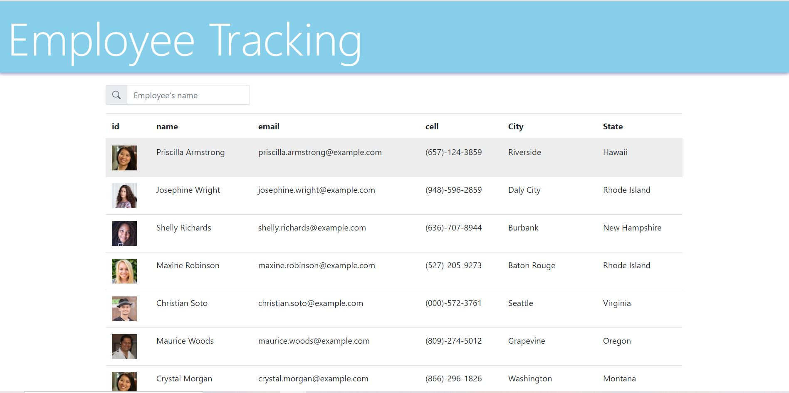

# ReactEmployeeTracker

## User Story 

As a user, I want to be able to pull up a list of all the employees in my company with their contact info. I also want to be able to search for a specific employee and sort results by first name.

## Technologies Used

- React
- Bootstrap
- Random User API
- Axios

## Installation

run: npm i

to start app run: npm start

## Features

* Displays randomly created users from the Random User API with contact info, picture, and location

* Allows user to search for a specific employee, and automatically updates list as the user begins to enter their search

* Users can also sort employees by first name

## Contributors

Michael Cervantes

## See the app here: 

https://mac95860.github.io/ReactEmployeeTracker/

##

